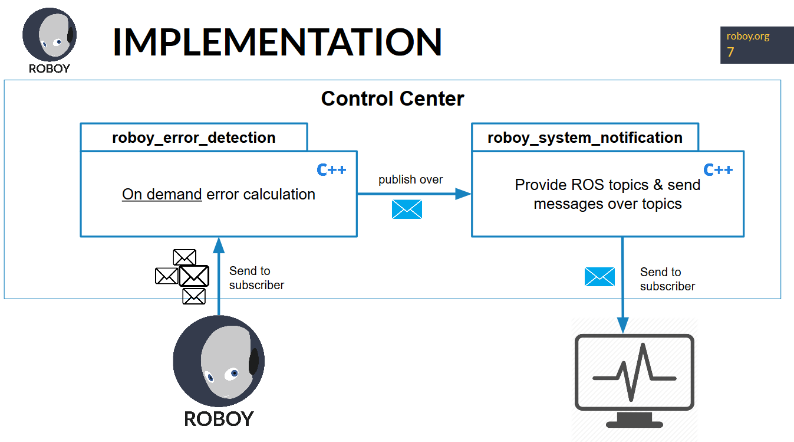
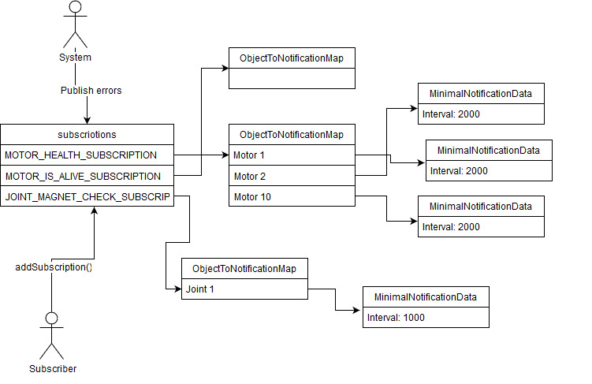

# System Overview

## System Model

The module works like this: 

 - The module receives information from Roboy (or any data source) over ROS topic subscriptions
 - The module analyses the data and checks it for not "normal" information/structures. If the module detects something, it publishes the information over 
 the Roboy System Notification module to share the information with all subscribers (like a monitoring system).



## Subscription Schema

Other modules, like a monitoring system can subscribe to the calculated error patterns so that it will be 
informed if something unwanted happened. This information is stored in the following data struct because 
we have different subscription types (=error patterns), which then can refer to specific motors or joints. In addition to this, 
also these objects can have multiple properties, like a notification interval, which are stored e.g. in a MinimalNotificationData struct. 



## Code structure

```
-bin
---run-docker.sh                # executable to build/compile module on a docker container
-docs                           # documentation
-include
---roboy_error_detection
-----common_utilities.hpp       # common definitions, like enums
-----main_common.hpp            # common methods for main classes
-----roboyErrorDetection.hpp    # interface for functionality class
-src
---main                         # main classes
---roboyErrorDetection.cpp      # functionality class
-Dockerfile                     # instructions to build files
-docker-compose.yml             # docker infrastructure instructions
```
